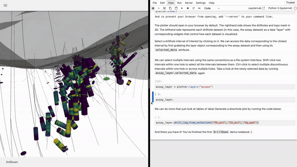
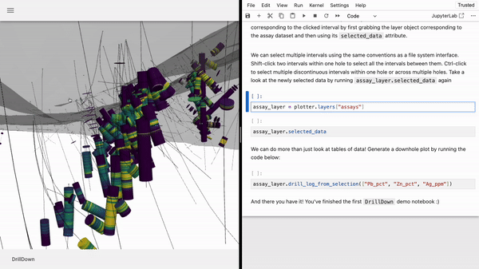
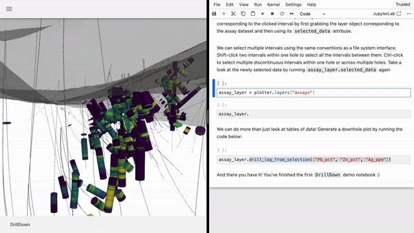
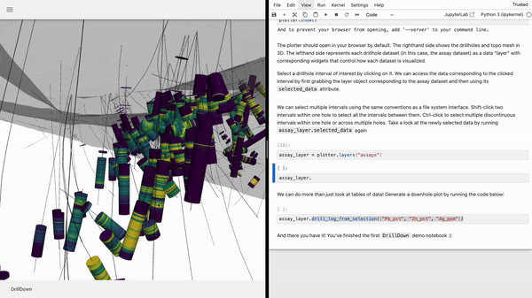
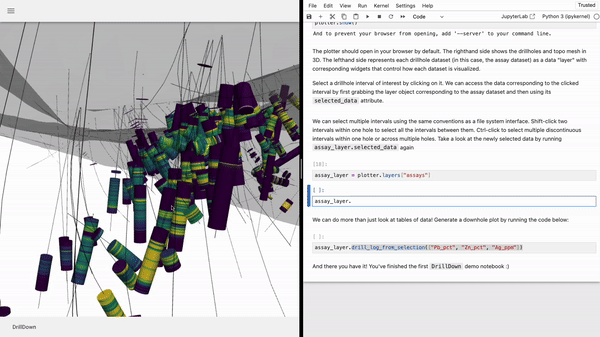

# DrillDown
Welcome! `DrillDown` is a visualization and analysis toolkit for "drilling down" into ore deposits datasets. Check out the poster below for more info: 

# Features

## Launch from jupyter notebook

### Filter by data values

### Get data by selection

### Downhole plot from selection

### Histogram from selection

### 2D scatter plot with cross-filtering

### Core photos from selection: 

...and more!

## Installation for development
- Use python 3.10 (imposed by geoh5py dependency)
- Install dependencies via pip using the provided `requirements.txt` file
- Run `pip install -e .` in the root director to install `drilldown` in editable mode